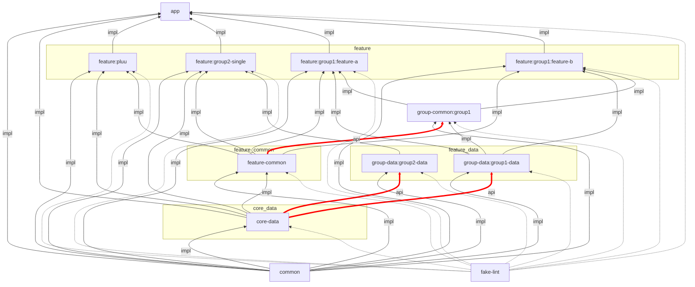
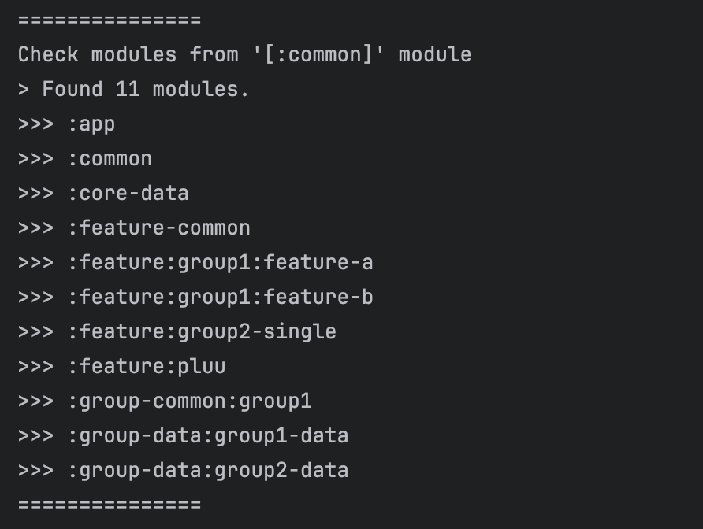
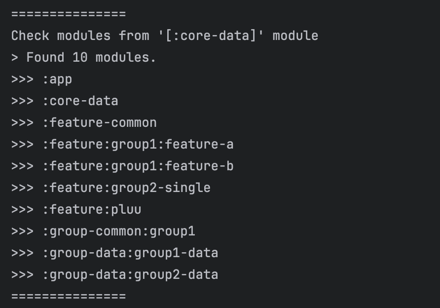
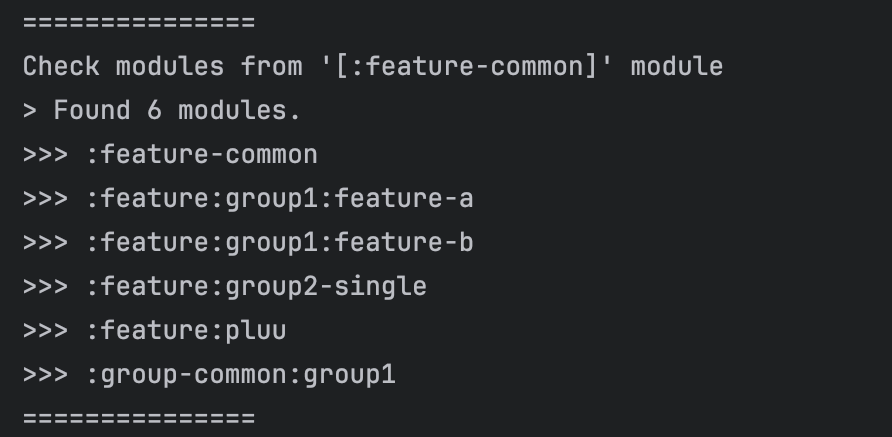
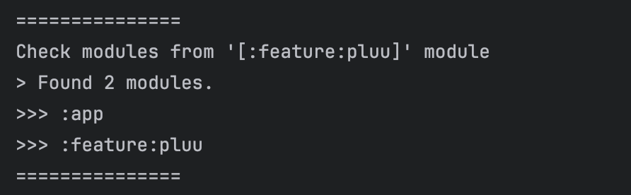
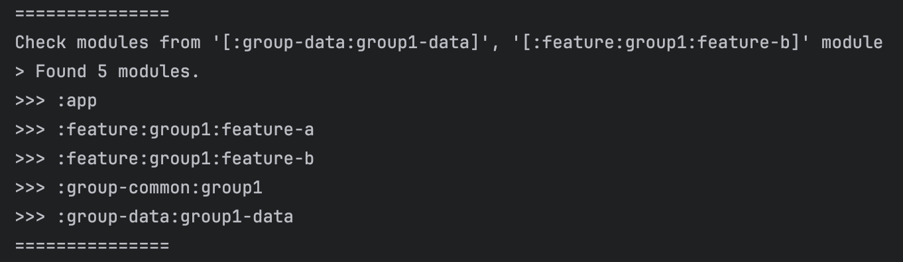

## Module Graph

## Result

|        change :common        |      change :core-data       |
| :--------------------------: | :--------------------------: |
|  |  |

|    change :feature-common    |     change :feature:pluu     |
| :--------------------------: | :--------------------------: |
|  |  |

| change :group-data:group1-data and :feature:group1:feature-b |
| :----------------------------------------------------------: |
|                         |

