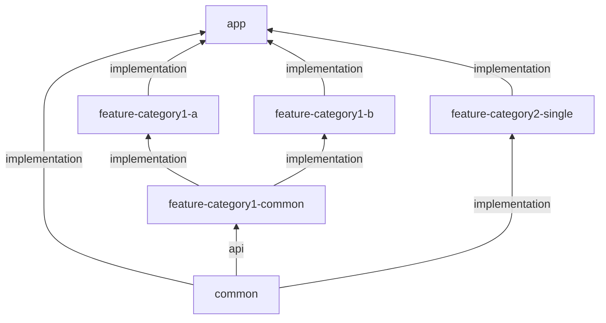

```mermaid
  graph BT;
      common--implementation-->app;
      feature-category1-a--implementation-->app;
      feature-category1-b--implementation-->app;
      feature-category2-single--implementation-->app;
      feature-category1-common--implementation-->feature-category1-a;
      feature-category1-common--implementation-->feature-category1-b;
      common--api-->feature-category1-common;
      common--implementation-->feature-category2-single;

```
