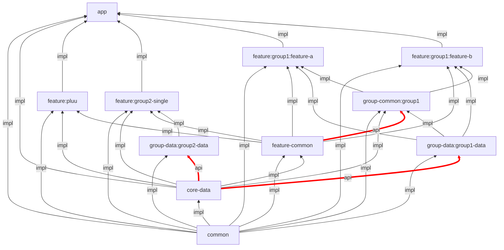

```mermaid
graph BT;
common--impl-->app;
common--impl-->core-data;
common--impl-->feature-common;
common--impl-->feature:pluu;
common--impl-->group-data:group1-data;
common--impl-->group-common:group1;
common--impl-->feature:group1:feature-a;
common--impl-->feature:group1:feature-b;
common--impl-->group-data:group2-data;
common--impl-->feature:group2-single;

core-data--impl-->app;
core-data--impl-->feature-common;
core-data--impl-->feature:pluu;
core-data--api-->group-data:group1-data;
core-data--impl-->group-common:group1;
core-data--api-->group-data:group2-data;
core-data--impl-->feature:group2-single;

feature-common--impl-->feature:pluu;        
feature-common--api-->group-common:group1;
feature-common--impl-->feature:group1:feature-a;
feature-common--impl-->feature:group1:feature-b;
feature-common--impl-->feature:group2-single;   

group-data:group1-data--impl-->group-common:group1;
group-data:group1-data--impl-->feature:group1:feature-a;
group-data:group1-data--impl-->feature:group1:feature-b;

group-common:group1--impl-->feature:group1:feature-a;
group-common:group1--impl-->feature:group1:feature-b;      

feature:pluu--impl-->app;     
group-data:group2-data--impl-->feature:group2-single;           
feature:group2-single--impl-->app;
feature:group1:feature-a--impl-->app;
feature:group1:feature-b--impl-->app;     
      
linkStyle 13 stroke-width:4px,stroke:red
linkStyle 15 stroke-width:4px,stroke:red
linkStyle 18 stroke-width:4px,stroke:red
```
